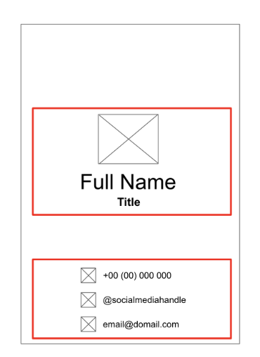

# Business Card App

This is a simple Business Card App developed using [Jetpack Compose].

[Compose Pathway Guide](https://developer.android.com/codelabs/basic-android-kotlin-compose-business-card?continue=https%3A%2F%2Fdeveloper.android.com%2Fcourses%2Fpathways%2Fandroid-basics-compose-unit-1-pathway-3%23codelab-https%3A%2F%2Fdeveloper.android.com%2Fcodelabs%2Fbasic-android-kotlin-compose-business-card)

Its Layout

Final Simple Screen

